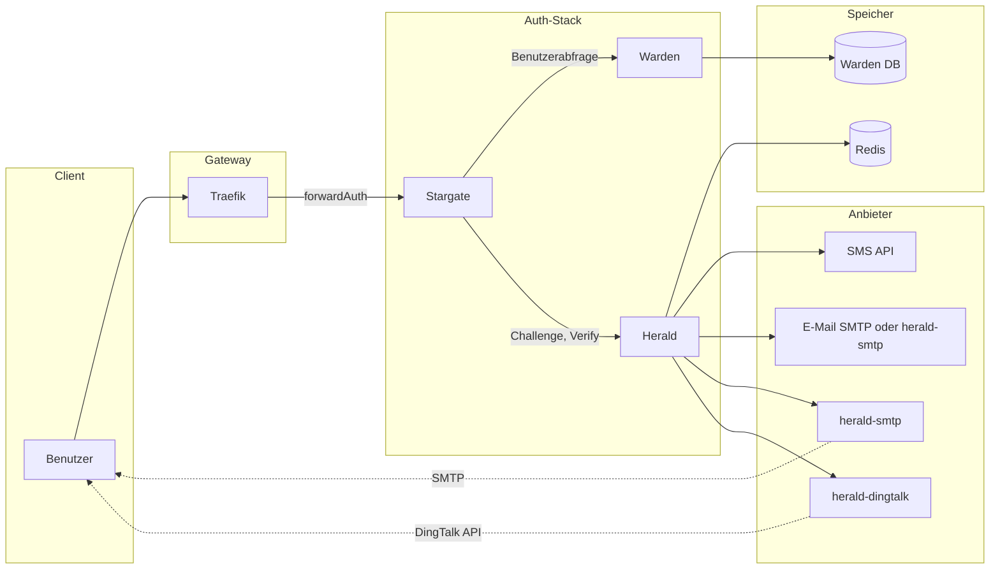

# Herald-Architektur

Dieses Dokument beschreibt die Full-Stack-Architektur des Authentifizierungsablaufs mit Stargate, Warden, Herald, Redis und externen Anbietern (SMS, E-Mail, DingTalk).

## Überblick

Herald ist der OTP- und Verifizierungscode-Dienst im Stargate- + Warden- + Herald-Stack. Stargate (forwardAuth) orchestriert die Anmeldung; Warden stellt die Benutzer-Whitelist und Kontaktdaten bereit; Herald erstellt Challenges, sendet Codes über Anbieter und verifiziert Codes. Herald speichert keine SMS-/E-Mail-/DingTalk-Anmeldedaten für externe Anbieter – diese liegen bei den Anbieterservices (z. B. [herald-smtp](https://github.com/soulteary/herald-smtp) für E-Mail bei gesetztem `HERALD_SMTP_API_URL`, [herald-dingtalk](https://github.com/soulteary/herald-dingtalk) für DingTalk).

## Full-Stack-Architektur

## Datenfluss und zentrale Schnittstellen

### Anmeldeprozess (Challenge → Verify)

1. **Benutzer** greift auf geschützte Ressource zu → **Traefik** forwardAuth → **Stargate** (keine Session) → Weiterleitung zur Anmeldung.
2. Benutzer gibt Kennung ein (E-Mail/Telefon/Benutzername). **Stargate** ruft **Warden** auf, um den Benutzer aufzulösen und `user_id` + Ziel (E-Mail/Telefon/userid) zu erhalten.
3. **Stargate** ruft **Herald** `POST /v1/otp/challenges` auf (user_id, channel, destination, purpose). Herald erstellt eine Challenge in **Redis**, sendet den Code über **SMS**, **E-Mail** (eingebautes SMTP oder [herald-smtp](https://github.com/soulteary/herald-smtp) bei gesetztem `HERALD_SMTP_API_URL`) oder **herald-dingtalk** (Provider-Send).
4. Herald gibt `challenge_id`, `expires_in`, `next_resend_in` an Stargate zurück.
5. Benutzer sendet den Code. **Stargate** ruft **Herald** `POST /v1/otp/verifications` auf (challenge_id, code).
6. Herald verifiziert gegen Redis, gibt `ok`, `user_id`, `amr`, `issued_at` zurück. Stargate erstellt Session (Cookie/JWT).
7. Nachfolgende forwardAuth: Stargate validiert nur die Session; es ruft **nicht** Warden oder Herald auf.

### Zentrale Schnittstellen

| Schnittstelle | Richtung | Beschreibung |
|---------------|----------|--------------|
| **Challenge erstellen** | Stargate → Herald | `POST /v1/otp/challenges` — OTP-Challenge erstellen und Code senden |
| **Verify** | Stargate → Herald | `POST /v1/otp/verifications` — Code verifizieren und user_id/amr erhalten |
| **Challenge widerrufen** | Stargate → Herald | `POST /v1/otp/challenges/{id}/revoke` — optionaler Widerruf |
| **Provider-Send** | Herald → Provider | `POST /v1/send` (HTTP) — Herald ruft SMS-/E-Mail-/DingTalk-Adapter auf; bei gesetztem `HERALD_SMTP_API_URL` E-Mail über herald-smtp; für DingTalk herald-dingtalk |
| **Benutzerabfrage** | Stargate → Warden | Warden-API — Kennung in user_id und destination auflösen |

### Herald ↔ Redis

- **Challenge-Daten**: `otp:ch:*` — Challenge-Payload, Code-Hash, TTL, Versuche.
- **Rate Limits**: `otp:rate:*` — pro Benutzer, pro IP, pro Ziel.
- **Idempotenz**: `otp:idem:*` — Idempotenzschlüssel → gecachte Challenge-Antwort.

## Sicherheitsgrenzen

- **Stargate ↔ Herald**: Authentifizierung per **mTLS**, **HMAC** (X-Signature, X-Timestamp, X-Service) oder **API Key** (X-API-Key). Herald lehnt fehlende oder ungültige Auth ab.
- **Herald ↔ Provider (z. B. herald-smtp, herald-dingtalk)**: Optionaler API Key (`HERALD_SMTP_API_KEY`, `HERALD_DINGTALK_API_KEY`). SMTP- und DingTalk-Anmeldedaten existieren nur in herald-smtp bzw. herald-dingtalk; Herald speichert sie nie.
- **PII**: Verifizierungscodes werden in Redis nur als Hash (z. B. Argon2) gespeichert. Destination (E-Mail/Telefon) wird zum Senden verwendet und kann in Audit-Logs maskiert erscheinen; Rohcodes nicht protokollieren.

## Verwandte Dokumentation

- [API.md](API.md) — Herald-HTTP-API (Challenges, Verifications, healthz)
- [DEPLOYMENT.md](DEPLOYMENT.md) — Konfiguration, Redis und Provider-Setup
- [SECURITY.md](SECURITY.md) — Authentifizierung und Sicherheitspraktiken
- [TROUBLESHOOTING.md](TROUBLESHOOTING.md) — Häufige Probleme (kein Code erhalten, ungültiger Code, 401, Rate Limits)
