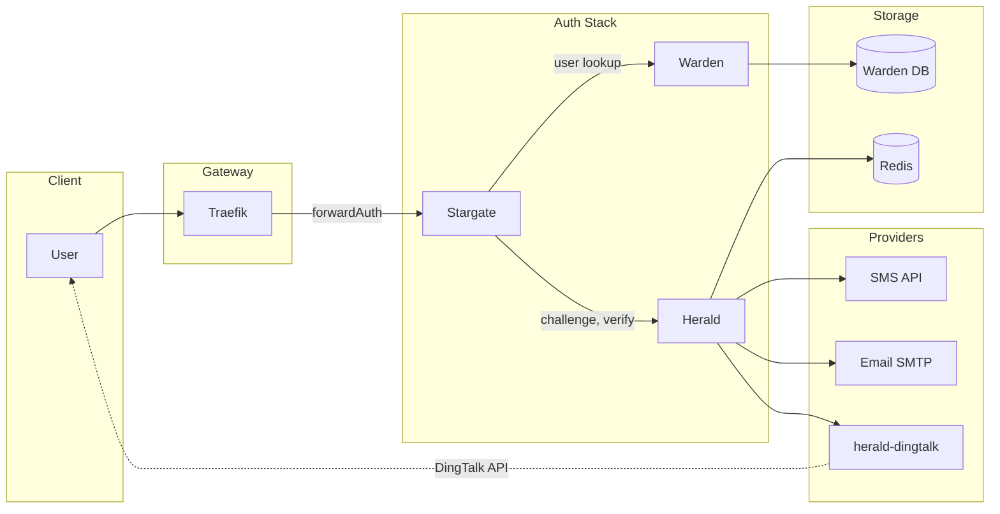

# Herald Architecture

This document describes the full-stack architecture of the authentication flow involving Stargate, Warden, Herald, Redis, and external providers (SMS, Email, DingTalk).

## Overview

Herald is the OTP and verification code service in the Stargate + Warden + Herald stack. Stargate (forwardAuth) orchestrates login; Warden provides user whitelist and contact info; Herald creates challenges, sends codes via providers, and verifies codes. Herald does not hold SMS/email/DingTalk credentials for external providers—those live in provider services (e.g. [herald-dingtalk](https://github.com/soulteary/herald-dingtalk) for DingTalk).

## Full-Stack Architecture

## Data Flow and Key Interfaces

### Login Flow (Challenge → Verify)

1. **User** hits a protected resource → **Traefik** forwardAuth → **Stargate** (no session) → redirect to login.
2. User enters identifier (email/phone/username). **Stargate** calls **Warden** to resolve user and get `user_id` + destination (email/phone/userid).
3. **Stargate** calls **Herald** `POST /v1/otp/challenges` (user_id, channel, destination, purpose). Herald creates a challenge in **Redis**, sends the code via **SMS**, **Email**, or **herald-dingtalk** (provider send).
4. Herald returns `challenge_id`, `expires_in`, `next_resend_in` to Stargate.
5. User submits the code. **Stargate** calls **Herald** `POST /v1/otp/verifications` (challenge_id, code).
6. Herald verifies against Redis, returns `ok`, `user_id`, `amr`, `issued_at`. Stargate creates session (cookie/JWT).
7. Subsequent forwardAuth: Stargate only validates session; it does **not** call Warden or Herald.

### Key Interfaces

| Interface | Direction | Description |
|-----------|-----------|-------------|
| **Challenge create** | Stargate → Herald | `POST /v1/otp/challenges` — create OTP challenge and send code |
| **Verify** | Stargate → Herald | `POST /v1/otp/verifications` — verify code and get user_id/amr |
| **Revoke challenge** | Stargate → Herald | `POST /v1/otp/challenges/{id}/revoke` — optional revoke |
| **Provider send** | Herald → Provider | `POST /v1/send` (HTTP) — Herald calls SMS/Email/DingTalk adapter; for DingTalk, Herald calls herald-dingtalk |
| **User lookup** | Stargate → Warden | Warden API — resolve identifier to user_id and destination |

### Herald ↔ Redis

- **Challenge data**: `otp:ch:*` — challenge payload, code hash, TTL, attempts.
- **Rate limits**: `otp:rate:*` — per user, per IP, per destination.
- **Idempotency**: `otp:idem:*` — idempotency key → cached challenge response.

## Security Boundaries

- **Stargate ↔ Herald**: Authenticated by **mTLS**, **HMAC** (X-Signature, X-Timestamp, X-Service), or **API Key** (X-API-Key). Herald rejects missing or invalid auth.
- **Herald ↔ Provider (e.g. herald-dingtalk)**: Optional API Key (`HERALD_DINGTALK_API_KEY`). DingTalk credentials exist only in herald-dingtalk; Herald never stores them.
- **PII**: Verification codes are stored only as hashes (e.g. Argon2) in Redis. Destination (email/phone) is used for sending and may appear in audit logs in masked form; avoid logging raw codes.

## Related Documentation

- [API.md](API.md) — Herald HTTP API (challenges, verifications, healthz)
- [DEPLOYMENT.md](DEPLOYMENT.md) — Configuration, Redis, and provider setup
- [SECURITY.md](SECURITY.md) — Authentication and security practices
- [TROUBLESHOOTING.md](TROUBLESHOOTING.md) — Common issues (no code received, invalid code, 401, rate limits)
