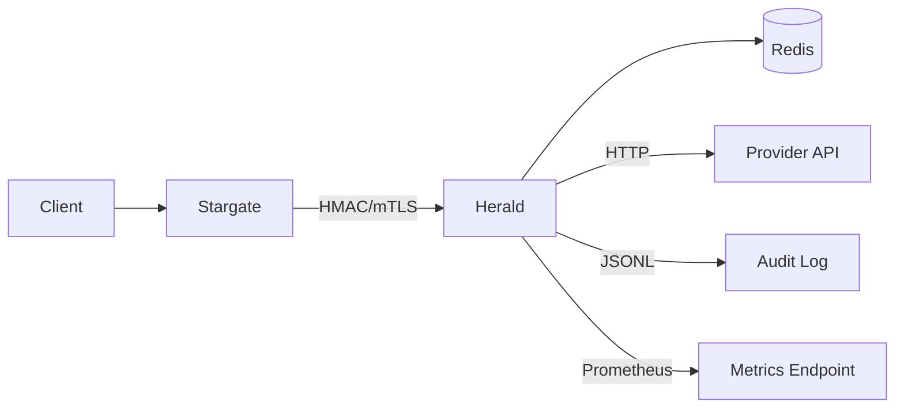

# Herald Deployment Guide

## Quick Start

### Using Docker Compose

```bash
cd herald
docker-compose up -d
```

### Manual Deployment

```bash
# Build
go build -o herald main.go

# Run
./herald
```

## Configuration

### Environment Variables

| Variable | Description | Default | Required |
|----------|-------------|---------|----------|
| `PORT` | Server port (can be with or without leading colon, e.g., `8082` or `:8082`) | `:8082` | No |
| `REDIS_ADDR` | Redis address | `localhost:6379` | No |
| `REDIS_PASSWORD` | Redis password | `` | No |
| `REDIS_DB` | Redis database | `0` | No |
| `API_KEY` | API key for authentication | `` | Recommended |
| `HMAC_SECRET` | HMAC secret for secure auth | `` | Optional |
| `LOG_LEVEL` | Log level | `info` | No |
| `CHALLENGE_EXPIRY` | Challenge expiration | `5m` | No |
| `MAX_ATTEMPTS` | Max verification attempts | `5` | No |
| `RESEND_COOLDOWN` | Resend cooldown | `60s` | No |
| `CODE_LENGTH` | Verification code length | `6` | No |
| `RATE_LIMIT_PER_USER` | Rate limit per user/hour | `10` | No |
| `RATE_LIMIT_PER_IP` | Rate limit per IP/minute | `5` | No |
| `RATE_LIMIT_PER_DESTINATION` | Rate limit per destination/hour | `10` | No |
| `LOCKOUT_DURATION` | User lockout duration after max attempts | `10m` | No |
| `IDEMPOTENCY_TTL` | Idempotency key TTL | `5m` | No |
| `SERVICE_NAME` | Service identifier for HMAC auth | `herald` | No |
| `EMAIL_API_URL` | Email provider API endpoint | `` | For email |
| `EMAIL_API_KEY` | Email provider API key | `` | Optional |
| `EMAIL_FROM` | Email sender address | `` | For email |
| `SMS_API_URL` | SMS provider API endpoint | `` | For SMS |
| `SMS_API_KEY` | SMS provider API key | `` | Optional |
| `PROVIDER_TIMEOUT` | External provider timeout | `5s` | No |
| `PROVIDER_FAILURE_POLICY` | Provider failure policy (`soft`/`strict`) | `soft` | No |
| `METRICS_ENABLED` | Enable Prometheus metrics | `false` | No |
| `METRICS_PATH` | Metrics endpoint path | `/metrics` | No |
| `AUDIT_LOG_ENABLED` | Enable audit logging | `true` | No |
| `AUDIT_LOG_PATH` | Audit log file path | `./audit.log` | No |
| `AUDIT_MASK_DESTINATION` | Mask destination in audit logs | `true` | No |

## Metrics

Enable metrics and access `METRICS_PATH` (default `/metrics`) for Prometheus-compatible output.

```bash
export METRICS_ENABLED=true
export METRICS_PATH=/metrics
```

## Audit Logging

Herald supports JSONL-format audit logging, enabled by default.

### Configuration

| Variable | Description | Default | Required |
|----------|-------------|---------|----------|
| `AUDIT_LOG_ENABLED` | Enable audit logging | `true` | No |
| `AUDIT_LOG_PATH` | Audit log file path | `./audit.log` | No |
| `AUDIT_MASK_DESTINATION` | Mask destination (email/phone) | `true` | No |

### Audit Events

Audit logs record the following events:
- `challenge_created` - Challenge created and sent successfully
- `challenge_send_failed` - Send failed
- `challenge_verified` - Verification succeeded
- `challenge_verify_failed` - Verification failed
- `challenge_revoked` - Challenge revoked

Each event includes: `event`, `challenge_id`, `user_id`, `channel`, `destination_masked`, `provider`, `result`, `reason`, `client_ip`, `traceparent`, `tracestate`, `created_at`.

## Distributed Tracing

Herald supports W3C Trace Context standard, automatically propagating `traceparent` and `tracestate` headers.

- Reads `traceparent`/`tracestate` from request headers
- Records trace information in audit logs
- Propagates trace headers when calling external Provider APIs

## Architecture Diagram



### Data Flow

1. **Challenge Creation Flow**:
   - Stargate → Herald: Create challenge request (with traceparent)
   - Herald: Create challenge, store in Redis
   - Herald → Provider API: Send verification code (propagate traceparent)
   - Herald: Record audit log (with trace info)
   - Herald → Stargate: Return challenge_id

2. **Verification Flow**:
   - Stargate → Herald: Verification request
   - Herald: Read challenge from Redis, verify code
   - Herald: Record audit log
   - Herald → Stargate: Return verification result

## Troubleshooting Guide

### Not Receiving Verification Code

1. **Check Provider Configuration**:
   ```bash
   # Check environment variables
   echo $EMAIL_API_URL
   echo $SMS_API_URL
   ```

2. **View Metrics**:
   ```bash
   curl http://localhost:8082/metrics | grep herald_otp_sends_total
   ```
   Check counts for `result="failed"`

3. **View Audit Logs**:
   ```bash
   tail -f audit.log | grep challenge_send_failed
   ```

4. **Check Provider Failure Policy**:
   - With `PROVIDER_FAILURE_POLICY=strict`, send failures return 502
   - With `PROVIDER_FAILURE_POLICY=soft`, send failures still create challenge

### Invalid Verification Code

1. **Check Challenge Status**:
   - View `challenge_verify_failed` events in audit logs
   - Check `reason` field: `expired`, `invalid`, `locked`

2. **Check Attempt Count**:
   - Default maximum 5 failed attempts
   - Challenge is locked after exceeding limit

3. **Check Rate Limits**:
   ```bash
   curl http://localhost:8082/metrics | grep rate_limit_hits_total
   ```

### 401 Unauthorized

1. **Check Authentication Configuration**:
   ```bash
   echo $API_KEY
   echo $HMAC_SECRET
   ```

2. **Verify HMAC Signature**:
   - Check `X-Signature`, `X-Timestamp`, `X-Service` headers
   - Timestamp drift must be within 5 minutes

3. **View Logs**:
   ```bash
   # View authentication failure logs
   tail -f logs | grep "authentication_required\|invalid_signature"
   ```

### Rate Limit Triggered

1. **Check Rate Limit Configuration**:
   ```bash
   echo $RATE_LIMIT_PER_USER
   echo $RATE_LIMIT_PER_IP
   echo $RATE_LIMIT_PER_DESTINATION
   ```

2. **View Rate Limit Metrics**:
   ```bash
   curl http://localhost:8082/metrics | grep rate_limit_hits_total
   ```

3. **Wait for Cooldown**:
   - User lockout: `LOCKOUT_DURATION` (default 10 minutes)
   - Resend cooldown: `RESEND_COOLDOWN` (default 60 seconds)

### Redis Connection Issues

1. **Check Connection**:
   ```bash
   redis-cli -h $REDIS_ADDR ping
   ```

2. **Check Health Endpoint**:
   ```bash
   curl http://localhost:8082/health
   ```

3. **View Logs**:
   ```bash
   tail -f logs | grep "Failed to connect to Redis"
   ```

### Idempotency Key Conflict

1. **Check Idempotency-Key**:
   - Requests with same key must have identical content
   - Different content returns 409 Conflict

2. **View Audit Logs**:
   - Check for duplicate `challenge_created` events

## Security

- Use HMAC authentication for production
- Set strong API keys
- Use TLS/HTTPS in production
- Configure rate limits appropriately
- Monitor Redis for suspicious activity
- Enable audit logging and archive regularly
- Use independent Redis DB to avoid key conflicts
