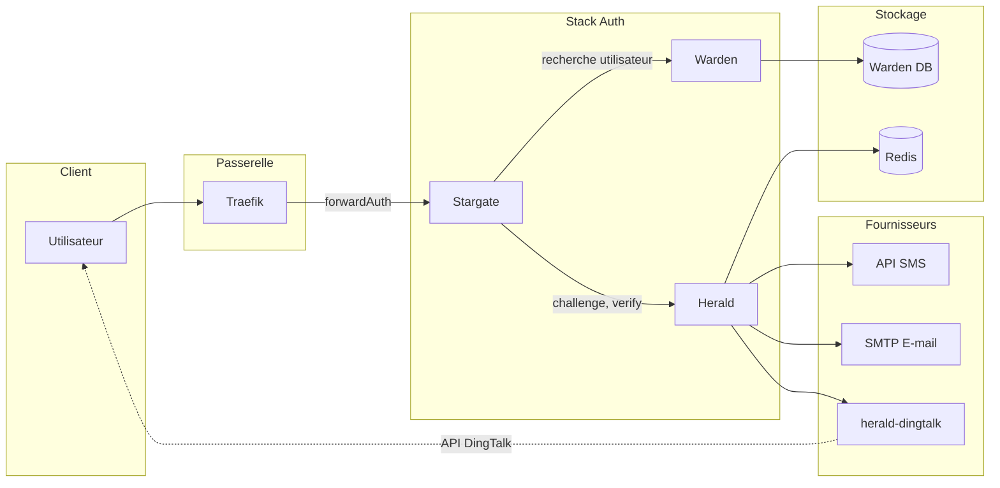

# Architecture Herald

Ce document décrit l'architecture full-stack du flux d'authentification impliquant Stargate, Warden, Herald, Redis et les fournisseurs externes (SMS, E-mail, DingTalk).

## Aperçu

Herald est le service OTP et codes de vérification dans la pile Stargate + Warden + Herald. Stargate (forwardAuth) orchestre la connexion ; Warden fournit la liste blanche des utilisateurs et les informations de contact ; Herald crée les défis, envoie les codes via les fournisseurs et vérifie les codes. Herald ne détient pas les identifiants SMS/e-mail/DingTalk des fournisseurs externes — ceux-ci résident dans les services fournisseurs (ex. [herald-dingtalk](https://github.com/soulteary/herald-dingtalk) pour DingTalk).

## Architecture full-stack

## Flux de données et interfaces clés

### Flux de connexion (Challenge → Verify)

1. **Utilisateur** accède à une ressource protégée → **Traefik** forwardAuth → **Stargate** (pas de session) → redirection vers la connexion.
2. L'utilisateur saisit l'identifiant (e-mail/téléphone/nom d'utilisateur). **Stargate** appelle **Warden** pour résoudre l'utilisateur et obtenir `user_id` + destination (e-mail/téléphone/userid).
3. **Stargate** appelle **Herald** `POST /v1/otp/challenges` (user_id, channel, destination, purpose). Herald crée un défi dans **Redis**, envoie le code via **SMS**, **E-mail** ou **herald-dingtalk** (envoi fournisseur).
4. Herald retourne `challenge_id`, `expires_in`, `next_resend_in` à Stargate.
5. L'utilisateur soumet le code. **Stargate** appelle **Herald** `POST /v1/otp/verifications` (challenge_id, code).
6. Herald vérifie contre Redis, retourne `ok`, `user_id`, `amr`, `issued_at`. Stargate crée la session (cookie/JWT).
7. forwardAuth suivants : Stargate ne valide que la session ; il n'appelle **pas** Warden ni Herald.

### Interfaces clés

| Interface | Direction | Description |
|-----------|-----------|-------------|
| **Créer un challenge** | Stargate → Herald | `POST /v1/otp/challenges` — créer un challenge OTP et envoyer le code |
| **Verify** | Stargate → Herald | `POST /v1/otp/verifications` — vérifier le code et obtenir user_id/amr |
| **Révoquer un challenge** | Stargate → Herald | `POST /v1/otp/challenges/{id}/revoke` — révocation optionnelle |
| **Envoi fournisseur** | Herald → Fournisseur | `POST /v1/send` (HTTP) — Herald appelle l'adaptateur SMS/E-mail/DingTalk ; pour DingTalk, Herald appelle herald-dingtalk |
| **Recherche utilisateur** | Stargate → Warden | API Warden — résoudre l'identifiant en user_id et destination |

### Herald ↔ Redis

- **Données de challenge** : `otp:ch:*` — payload du challenge, hash du code, TTL, tentatives.
- **Limites de débit** : `otp:rate:*` — par utilisateur, par IP, par destination.
- **Idempotence** : `otp:idem:*` — clé d'idempotence → réponse de challenge en cache.

## Périmètres de sécurité

- **Stargate ↔ Herald** : Authentifié par **mTLS**, **HMAC** (X-Signature, X-Timestamp, X-Service) ou **API Key** (X-API-Key). Herald rejette les requêtes non authentifiées ou invalides.
- **Herald ↔ Fournisseur (ex. herald-dingtalk)** : API Key optionnelle (`HERALD_DINGTALK_API_KEY`). Les identifiants DingTalk n'existent que dans herald-dingtalk ; Herald ne les stocke jamais.
- **PII** : Les codes de vérification ne sont stockés dans Redis que sous forme de hash (ex. Argon2). La destination (e-mail/téléphone) est utilisée pour l'envoi et peut apparaître dans les logs d'audit de manière masquée ; ne pas logger les codes en clair.

## Documentation associée

- [API.md](API.md) — API HTTP Herald (challenges, verifications, healthz)
- [DEPLOYMENT.md](DEPLOYMENT.md) — Configuration, Redis et déploiement des fournisseurs
- [SECURITY.md](SECURITY.md) — Authentification et bonnes pratiques de sécurité
- [TROUBLESHOOTING.md](TROUBLESHOOTING.md) — Problèmes courants (code non reçu, code invalide, 401, limites de débit)
