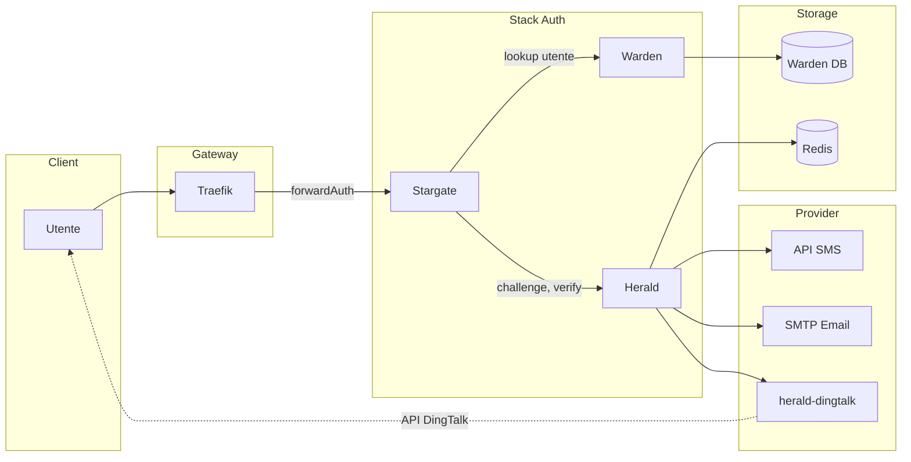

# Architettura Herald

Questo documento descrive l'architettura full-stack del flusso di autenticazione che coinvolge Stargate, Warden, Herald, Redis e provider esterni (SMS, Email, DingTalk).

## Panoramica

Herald è il servizio OTP e codici di verifica nello stack Stargate + Warden + Herald. Stargate (forwardAuth) orchestra il login; Warden fornisce la whitelist utenti e le informazioni di contatto; Herald crea le challenge, invia i codici tramite i provider e verifica i codici. Herald non detiene le credenziali SMS/email/DingTalk per i provider esterni — quelle risiedono nei servizi provider (es. [herald-dingtalk](https://github.com/soulteary/herald-dingtalk) per DingTalk).

## Architettura full-stack

## Flusso dati e interfacce chiave

### Flusso di login (Challenge → Verify)

1. **Utente** accede a una risorsa protetta → **Traefik** forwardAuth → **Stargate** (nessuna sessione) → redirect al login.
2. L'utente inserisce l'identificativo (email/telefono/username). **Stargate** chiama **Warden** per risolvere l'utente e ottenere `user_id` + destination (email/phone/userid).
3. **Stargate** chiama **Herald** `POST /v1/otp/challenges` (user_id, channel, destination, purpose). Herald crea una challenge in **Redis**, invia il codice tramite **SMS**, **Email** o **herald-dingtalk** (invio provider).
4. Herald restituisce `challenge_id`, `expires_in`, `next_resend_in` a Stargate.
5. L'utente invia il codice. **Stargate** chiama **Herald** `POST /v1/otp/verifications` (challenge_id, code).
6. Herald verifica contro Redis, restituisce `ok`, `user_id`, `amr`, `issued_at`. Stargate crea la sessione (cookie/JWT).
7. forwardAuth successivi: Stargate valida solo la sessione; **non** chiama Warden o Herald.

### Interfacce chiave

| Interfaccia | Direzione | Descrizione |
|-------------|------------|-------------|
| **Crea challenge** | Stargate → Herald | `POST /v1/otp/challenges` — crea challenge OTP e invia il codice |
| **Verify** | Stargate → Herald | `POST /v1/otp/verifications` — verifica il codice e ottieni user_id/amr |
| **Revoca challenge** | Stargate → Herald | `POST /v1/otp/challenges/{id}/revoke` — revoca opzionale |
| **Invio provider** | Herald → Provider | `POST /v1/send` (HTTP) — Herald chiama l'adattatore SMS/Email/DingTalk; per DingTalk, Herald chiama herald-dingtalk |
| **Lookup utente** | Stargate → Warden | API Warden — risolvi identificativo in user_id e destination |

### Herald ↔ Redis

- **Dati challenge**: `otp:ch:*` — payload challenge, hash codice, TTL, tentativi.
- **Rate limit**: `otp:rate:*` — per utente, per IP, per destination.
- **Idempotenza**: `otp:idem:*` — chiave idempotenza → risposta challenge in cache.

## Confini di sicurezza

- **Stargate ↔ Herald**: Autenticato con **mTLS**, **HMAC** (X-Signature, X-Timestamp, X-Service) o **API Key** (X-API-Key). Herald rifiuta richieste non autenticate o non valide.
- **Herald ↔ Provider (es. herald-dingtalk)**: API Key opzionale (`HERALD_DINGTALK_API_KEY`). Le credenziali DingTalk esistono solo in herald-dingtalk; Herald non le memorizza mai.
- **PII**: I codici di verifica sono memorizzati in Redis solo come hash (es. Argon2). La destination (email/telefono) è usata per l'invio e può apparire nei log di audit in forma mascherata; evitare di loggare i codici in chiaro.

## Documentazione correlata

- [API.md](API.md) — API HTTP Herald (challenges, verifications, healthz)
- [DEPLOYMENT.md](DEPLOYMENT.md) — Configurazione, Redis e setup provider
- [SECURITY.md](SECURITY.md) — Autenticazione e pratiche di sicurezza
- [TROUBLESHOOTING.md](TROUBLESHOOTING.md) — Problemi comuni (codice non ricevuto, codice invalido, 401, rate limit)
