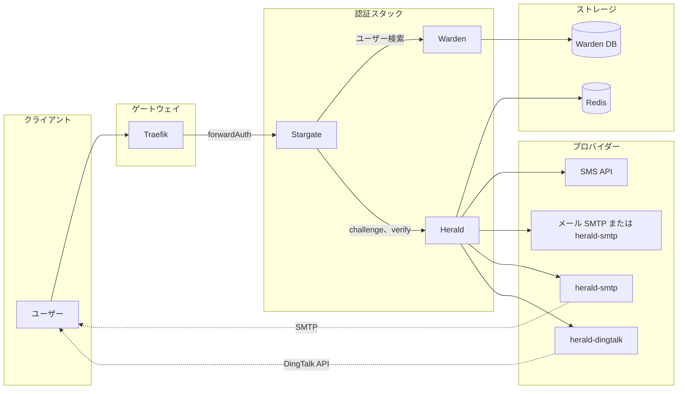

# Herald アーキテクチャ

このドキュメントでは、Stargate、Warden、Herald、Redis、および外部プロバイダー（SMS、メール、DingTalk）を含む認証フローのフルスタックアーキテクチャについて説明します。

## 概要

Herald は Stargate + Warden + Herald スタックにおける OTP および検証コードサービスです。Stargate（forwardAuth）がログインをオーケストレーションし、Warden がユーザー whitelist と連絡先情報を提供し、Herald がチャレンジの作成、プロバイダー経由でのコード送信、コード検証を行います。Herald は外部プロバイダー用の SMS/メール/DingTalk の認証情報を保持しません。これらはプロバイダーサービス（`HERALD_SMTP_API_URL` 設定時はメール用 [herald-smtp](https://github.com/soulteary/herald-smtp)、DingTalk の場合は [herald-dingtalk](https://github.com/soulteary/herald-dingtalk) など）に存在します。

## フルスタックアーキテクチャ

## データフローと主要インターフェース

### ログインフロー（Challenge → Verify）

1. **ユーザー** が保護されたリソースにアクセス → **Traefik** forwardAuth → **Stargate**（セッションなし）→ ログインへリダイレクト。
2. ユーザーが識別子（メール/電話/ユーザー名）を入力。**Stargate** が **Warden** を呼び出してユーザーを解決し、`user_id` と destination（email/phone/userid）を取得。
3. **Stargate** が **Herald** の `POST /v1/otp/challenges`（user_id、channel、destination、purpose）を呼び出し。Herald が **Redis** にチャレンジを作成し、**SMS**、**メール**（組み込み SMTP または `HERALD_SMTP_API_URL` 設定時の [herald-smtp](https://github.com/soulteary/herald-smtp)）、または **herald-dingtalk**（プロバイダー送信）でコードを送信。
4. Herald が `challenge_id`、`expires_in`、`next_resend_in` を Stargate に返す。
5. ユーザーがコードを送信。**Stargate** が **Herald** の `POST /v1/otp/verifications`（challenge_id、code）を呼び出し。
6. Herald が Redis に対して検証し、`ok`、`user_id`、`amr`、`issued_at` を返す。Stargate がセッション（cookie/JWT）を作成。
7. 以降の forwardAuth：Stargate はセッションのみ検証し、Warden や Herald は**呼び出さない**。

### 主要インターフェース

| インターフェース | 方向 | 説明 |
|------------------|------|------|
| **チャレンジ作成** | Stargate → Herald | `POST /v1/otp/challenges` — OTP チャレンジを作成してコードを送信 |
| **Verify** | Stargate → Herald | `POST /v1/otp/verifications` — コードを検証して user_id/amr を取得 |
| **チャレンジ取り消し** | Stargate → Herald | `POST /v1/otp/challenges/{id}/revoke` — オプションの取り消し |
| **プロバイダー送信** | Herald → プロバイダー | `POST /v1/send`（HTTP）— Herald が SMS/メール/DingTalk アダプターを呼び出し。`HERALD_SMTP_API_URL` 設定時はメールを herald-smtp へ。DingTalk の場合は herald-dingtalk を呼び出し |
| **ユーザー検索** | Stargate → Warden | Warden API — 識別子を user_id と destination に解決 |

### Herald ↔ Redis

- **チャレンジデータ**：`otp:ch:*` — チャレンジペイロード、コードハッシュ、TTL、試行回数。
- **レート制限**：`otp:rate:*` — ユーザー単位、IP 単位、destination 単位。
- **冪等性**：`otp:idem:*` — 冪等キー → キャッシュされたチャレンジ応答。

## セキュリティ境界

- **Stargate ↔ Herald**：**mTLS**、**HMAC**（X-Signature、X-Timestamp、X-Service）、または **API Key**（X-API-Key）で認証。Herald は認証がない、または無効なリクエストを拒否します。
- **Herald ↔ プロバイダー（例：herald-smtp、herald-dingtalk）**：オプションの API Key（`HERALD_SMTP_API_KEY`、`HERALD_DINGTALK_API_KEY`）。SMTP および DingTalk の認証情報はそれぞれ herald-smtp および herald-dingtalk にのみ存在し、Herald は保存しません。
- **PII**：検証コードは Redis にハッシュ（例：Argon2）としてのみ保存されます。destination（メール/電話）は送信用に使用され、監査ログにマスクされた形で表示される場合があります。生のコードをログに記録しないでください。

## 関連ドキュメント

- [API.md](API.md) — Herald HTTP API（challenges、verifications、healthz）
- [DEPLOYMENT.md](DEPLOYMENT.md) — 設定、Redis、プロバイダーセットアップ
- [SECURITY.md](SECURITY.md) — 認証とセキュリティプラクティス
- [TROUBLESHOOTING.md](TROUBLESHOOTING.md) — よくある問題（コードが届かない、無効なコード、401、レート制限）
