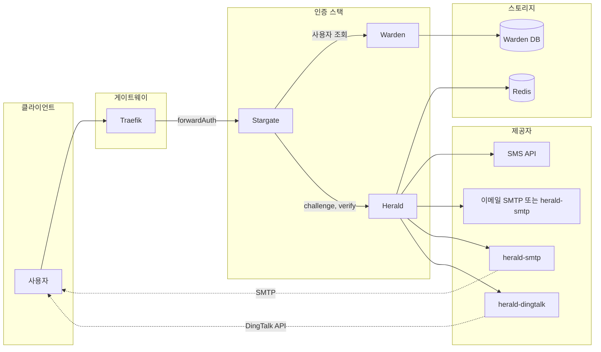

# Herald 아키텍처

이 문서는 Stargate, Warden, Herald, Redis 및 외부 제공자(SMS, 이메일, DingTalk)를 포함한 인증 흐름의 풀스택 아키텍처를 설명합니다.

## 개요

Herald는 Stargate + Warden + Herald 스택의 OTP 및 인증 코드 서비스입니다. Stargate(forwardAuth)가 로그인을 조율하고, Warden이 사용자 화이트리스트와 연락처 정보를 제공하며, Herald가 챌린지를 생성하고 제공자를 통해 코드를 보내며 검증합니다. Herald는 외부 제공자를 위한 SMS/이메일/DingTalk 자격 증명을 보유하지 않습니다. 해당 자격 증명은 제공자 서비스(예: `HERALD_SMTP_API_URL` 설정 시 이메일용 [herald-smtp](https://github.com/soulteary/herald-smtp), DingTalk의 [herald-dingtalk](https://github.com/soulteary/herald-dingtalk))에 있습니다.

## 풀스택 아키텍처

## 데이터 흐름 및 주요 인터페이스

### 로그인 흐름(Challenge → Verify)

1. **사용자**가 보호된 리소스에 접근 → **Traefik** forwardAuth → **Stargate**(세션 없음) → 로그인으로 리다이렉트.
2. 사용자가 식별자(이메일/전화/사용자명) 입력. **Stargate**가 **Warden**을 호출하여 사용자를 확인하고 `user_id` 및 destination(email/phone/userid) 획득.
3. **Stargate**가 **Herald** `POST /v1/otp/challenges`(user_id, channel, destination, purpose) 호출. Herald가 **Redis**에 챌린지 생성, **SMS**, **이메일**(내장 SMTP 또는 `HERALD_SMTP_API_URL` 설정 시 [herald-smtp](https://github.com/soulteary/herald-smtp)), **herald-dingtalk**(제공자 전송)로 코드 전송.
4. Herald가 `challenge_id`, `expires_in`, `next_resend_in`을 Stargate에 반환.
5. 사용자가 코드 제출. **Stargate**가 **Herald** `POST /v1/otp/verifications`(challenge_id, code) 호출.
6. Herald가 Redis와 대조 검증, `ok`, `user_id`, `amr`, `issued_at` 반환. Stargate가 세션(cookie/JWT) 생성.
7. 이후 forwardAuth: Stargate는 세션만 검증하며 Warden 또는 Herald를 **호출하지 않음**.

### 주요 인터페이스

| 인터페이스 | 방향 | 설명 |
|------------|------|------|
| **챌린지 생성** | Stargate → Herald | `POST /v1/otp/challenges` — OTP 챌린지 생성 및 코드 전송 |
| **Verify** | Stargate → Herald | `POST /v1/otp/verifications` — 코드 검증 및 user_id/amr 획득 |
| **챌린지 취소** | Stargate → Herald | `POST /v1/otp/challenges/{id}/revoke` — 선택적 취소 |
| **제공자 전송** | Herald → 제공자 | `POST /v1/send`(HTTP) — Herald가 SMS/이메일/DingTalk 어댑터 호출; `HERALD_SMTP_API_URL` 설정 시 이메일은 herald-smtp, DingTalk은 herald-dingtalk 호출 |
| **사용자 조회** | Stargate → Warden | Warden API — 식별자를 user_id 및 destination으로 확인 |

### Herald ↔ Redis

- **챌린지 데이터**: `otp:ch:*` — 챌린지 페이로드, 코드 해시, TTL, 시도 횟수.
- **속도 제한**: `otp:rate:*` — 사용자별, IP별, destination별.
- **멱등성**: `otp:idem:*` — 멱등 키 → 캐시된 챌린지 응답.

## 보안 경계

- **Stargate ↔ Herald**: **mTLS**, **HMAC**(X-Signature, X-Timestamp, X-Service) 또는 **API Key**(X-API-Key)로 인증. Herald는 누락되거나 잘못된 인증을 거부합니다.
- **Herald ↔ 제공자(예: herald-smtp, herald-dingtalk)**: 선택적 API Key(`HERALD_SMTP_API_KEY`, `HERALD_DINGTALK_API_KEY`). SMTP 및 DingTalk 자격 증명은 각각 herald-smtp 및 herald-dingtalk에만 존재하며 Herald는 저장하지 않습니다.
- **PII**: 검증 코드는 Redis에 해시(예: Argon2)로만 저장됩니다. destination(이메일/전화)은 전송에 사용되며 감사 로그에 마스킹된 형태로 나타날 수 있습니다. 원시 코드를 로깅하지 마세요.

## 관련 문서

- [API.md](API.md) — Herald HTTP API(challenges, verifications, healthz)
- [DEPLOYMENT.md](DEPLOYMENT.md) — 구성, Redis 및 제공자 설정
- [SECURITY.md](SECURITY.md) — 인증 및 보안 관행
- [TROUBLESHOOTING.md](TROUBLESHOOTING.md) — 일반적인 문제(코드 미수신, 잘못된 코드, 401, 속도 제한)
