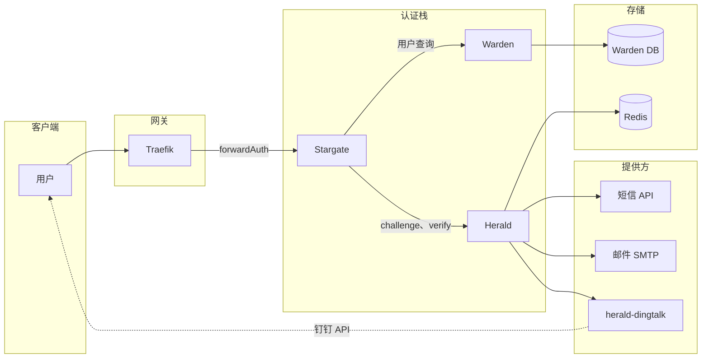

# Herald 架构说明

本文描述 Stargate、Warden、Herald、Redis 与外部提供方（短信、邮件、钉钉）组成的认证全栈架构。

## 概述

Herald 是 Stargate + Warden + Herald 体系中的 OTP 与验证码服务。Stargate（forwardAuth）负责登录编排；Warden 提供用户白名单与联系方式；Herald 负责创建 challenge、通过提供方发码、验码。Herald 不持有短信/邮件/钉钉的凭证，外部通道由独立服务提供（如钉钉由 [herald-dingtalk](https://github.com/soulteary/herald-dingtalk) 提供）。

## 全栈架构

## 数据流与关键接口

### 登录流程（Challenge → Verify）

1. **用户** 访问受保护资源 → **Traefik** forwardAuth → **Stargate**（无会话）→ 跳转登录页。
2. 用户输入标识（邮箱/手机/用户名）。**Stargate** 调用 **Warden** 解析用户，获得 `user_id` 与 destination（email/phone/userid）。
3. **Stargate** 调用 **Herald** `POST /v1/otp/challenges`（user_id、channel、destination、purpose）。Herald 在 **Redis** 中创建 challenge，通过 **短信**、**邮件** 或 **herald-dingtalk**（provider send）发送验证码。
4. Herald 向 Stargate 返回 `challenge_id`、`expires_in`、`next_resend_in`。
5. 用户提交验证码。**Stargate** 调用 **Herald** `POST /v1/otp/verifications`（challenge_id、code）。
6. Herald 在 Redis 中校验，返回 `ok`、`user_id`、`amr`、`issued_at`。Stargate 创建会话（cookie/JWT）。
7. 后续 forwardAuth：Stargate 仅校验会话，**不再**调用 Warden 或 Herald。

### 关键接口

| 接口 | 方向 | 说明 |
|------|------|------|
| **创建 Challenge** | Stargate → Herald | `POST /v1/otp/challenges` — 创建 OTP challenge 并发送验证码 |
| **验码** | Stargate → Herald | `POST /v1/otp/verifications` — 校验验证码并返回 user_id/amr |
| **作废 Challenge** | Stargate → Herald | `POST /v1/otp/challenges/{id}/revoke` — 可选作废 |
| **Provider 发送** | Herald → Provider | `POST /v1/send`（HTTP）— Herald 调用短信/邮件/钉钉适配器；钉钉通道由 herald-dingtalk 提供 |
| **用户查询** | Stargate → Warden | Warden API — 将标识解析为 user_id 与 destination |

### Herald ↔ Redis

- **Challenge 数据**：`otp:ch:*` — challenge 载荷、验证码哈希、TTL、尝试次数。
- **限流**：`otp:rate:*` — 按用户、IP、destination 限流。
- **幂等**：`otp:idem:*` — 幂等键 → 缓存的 challenge 响应。

## 安全边界

- **Stargate ↔ Herald**：通过 **mTLS**、**HMAC**（X-Signature、X-Timestamp、X-Service）或 **API Key**（X-API-Key）鉴权；Herald 拒绝未认证或签名错误的请求。
- **Herald ↔ Provider（如 herald-dingtalk）**：可选 API Key（`HERALD_DINGTALK_API_KEY`）。钉钉凭证仅存在于 herald-dingtalk；Herald 不存储钉钉凭证。
- **PII**：验证码仅以哈希（如 Argon2）形式存于 Redis。destination（邮箱/手机）用于发送，审计日志中建议脱敏；禁止记录明文验证码。

## 相关文档

- [API.md](API.md) — Herald HTTP API（challenges、verifications、healthz）
- [DEPLOYMENT.md](DEPLOYMENT.md) — 配置、Redis 与 Provider 部署
- [SECURITY.md](SECURITY.md) — 认证与安全实践
- [TROUBLESHOOTING.md](TROUBLESHOOTING.md) — 常见问题（收不到验证码、验证码错误、401、限流等）
