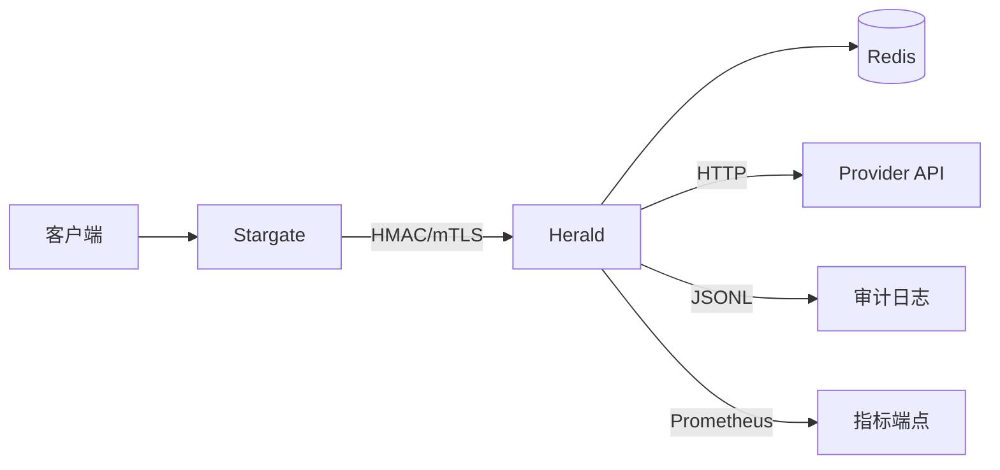

# Herald 部署指南

## 快速开始

### 使用 Docker Compose

```bash
cd herald
docker-compose up -d
```

### 手动部署

```bash
# 构建
go build -o herald main.go

# 运行
./herald
```

## 配置

### 环境变量

| 变量 | 描述 | 默认值 | 必需 |
|------|------|--------|------|
| `PORT` | 服务器端口（可以带或不带前导冒号，例如 `8082` 或 `:8082`） | `:8082` | 否 |
| `REDIS_ADDR` | Redis 地址 | `localhost:6379` | 否 |
| `REDIS_PASSWORD` | Redis 密码 | `` | 否 |
| `REDIS_DB` | Redis 数据库 | `0` | 否 |
| `API_KEY` | 用于身份验证的 API 密钥 | `` | 推荐 |
| `HMAC_SECRET` | 用于安全认证的 HMAC 密钥 | `` | 可选 |
| `LOG_LEVEL` | 日志级别 | `info` | 否 |
| `CHALLENGE_EXPIRY` | 挑战过期时间 | `5m` | 否 |
| `MAX_ATTEMPTS` | 最大验证尝试次数 | `5` | 否 |
| `RESEND_COOLDOWN` | 重发冷却时间 | `60s` | 否 |
| `CODE_LENGTH` | 验证码长度 | `6` | 否 |
| `RATE_LIMIT_PER_USER` | 每个用户/小时的速率限制 | `10` | 否 |
| `RATE_LIMIT_PER_IP` | 每个 IP/分钟的速率限制 | `5` | 否 |
| `RATE_LIMIT_PER_DESTINATION` | 每个目标/小时的速率限制 | `10` | 否 |
| `LOCKOUT_DURATION` | 达到最大尝试次数后的用户锁定持续时间 | `10m` | 否 |
| `IDEMPOTENCY_TTL` | 幂等键缓存时间 | `5m` | 否 |
| `SERVICE_NAME` | HMAC 认证的服务标识符 | `herald` | 否 |
| `EMAIL_API_URL` | 邮件服务 API 地址 | `` | 用于邮件 |
| `EMAIL_API_KEY` | 邮件服务 API Key | `` | 可选 |
| `EMAIL_FROM` | 邮件发件人地址 | `` | 用于邮件 |
| `SMS_API_URL` | 短信服务 API 地址 | `` | 用于短信 |
| `SMS_API_KEY` | 短信服务 API Key | `` | 可选 |
| `PROVIDER_TIMEOUT` | 外部服务超时时间 | `5s` | 否 |
| `PROVIDER_FAILURE_POLICY` | 发送失败策略（`soft`/`strict`） | `soft` | 否 |
| `METRICS_ENABLED` | 是否启用 Prometheus 指标 | `false` | 否 |
| `METRICS_PATH` | 指标暴露路径 | `/metrics` | 否 |

## 指标

启用后访问 `METRICS_PATH`（默认 `/metrics`）即可获取 Prometheus 兼容指标。

```bash
export METRICS_ENABLED=true
export METRICS_PATH=/metrics
```

## 与 Stargate 集成

1. 在 Stargate 配置中设置 `HERALD_URL`
2. 在 Stargate 配置中设置 `HERALD_API_KEY`
3. 在 Stargate 配置中设置 `HERALD_ENABLED=true`

示例：
```bash
export HERALD_URL=http://herald:8082
export HERALD_API_KEY=your-secret-key
export HERALD_ENABLED=true
```

## 审计日志

Herald 支持 JSONL 格式的审计日志记录，默认启用。

### 配置

| 变量 | 描述 | 默认值 | 必需 |
|------|------|--------|------|
| `AUDIT_LOG_ENABLED` | 是否启用审计日志 | `true` | 否 |
| `AUDIT_LOG_PATH` | 审计日志文件路径 | `./audit.log` | 否 |
| `AUDIT_MASK_DESTINATION` | 是否脱敏 destination（邮箱/手机） | `true` | 否 |

### 审计事件

审计日志记录以下事件：
- `challenge_created` - 挑战创建并发送成功
- `challenge_send_failed` - 发送失败
- `challenge_verified` - 验证成功
- `challenge_verify_failed` - 验证失败
- `challenge_revoked` - 挑战撤销

每个事件包含：`event`, `challenge_id`, `user_id`, `channel`, `destination_masked`, `provider`, `result`, `reason`, `client_ip`, `traceparent`, `tracestate`, `created_at`。

## 链路追踪

Herald 支持 W3C Trace Context 标准，自动透传 `traceparent` 和 `tracestate` header。

- 从请求 header 读取 `traceparent`/`tracestate`
- 在审计日志中记录 trace 信息
- 在调用外部 Provider API 时透传 trace header

## 架构图



### 数据流

1. **挑战创建流程**：
   - Stargate → Herald: 创建挑战请求（带 traceparent）
   - Herald: 创建 challenge，存储到 Redis
   - Herald → Provider API: 发送验证码（透传 traceparent）
   - Herald: 记录审计日志（包含 trace 信息）
   - Herald → Stargate: 返回 challenge_id

2. **验证流程**：
   - Stargate → Herald: 验证请求
   - Herald: 从 Redis 读取 challenge，验证 code
   - Herald: 记录审计日志
   - Herald → Stargate: 返回验证结果

## 故障排查指南

### 收不到验证码

1. **检查 Provider 配置**：
   ```bash
   # 检查环境变量
   echo $EMAIL_API_URL
   echo $SMS_API_URL
   ```

2. **查看指标**：
   ```bash
   curl http://localhost:8082/metrics | grep herald_otp_sends_total
   ```
   检查 `result="failed"` 的计数

3. **查看审计日志**：
   ```bash
   tail -f audit.log | grep challenge_send_failed
   ```

4. **检查 Provider 失败策略**：
   - `PROVIDER_FAILURE_POLICY=strict` 时，发送失败会返回 502
   - `PROVIDER_FAILURE_POLICY=soft` 时，发送失败仍创建 challenge

### 验证码错误

1. **检查 challenge 状态**：
   - 查看审计日志中的 `challenge_verify_failed` 事件
   - 检查 `reason` 字段：`expired`、`invalid`、`locked`

2. **检查尝试次数**：
   - 默认最多 5 次错误尝试
   - 超过后 challenge 会被锁定

3. **检查限流**：
   ```bash
   curl http://localhost:8082/metrics | grep rate_limit_hits_total
   ```

### 401 Unauthorized

1. **检查认证配置**：
   ```bash
   echo $API_KEY
   echo $HMAC_SECRET
   ```

2. **验证 HMAC 签名**：
   - 检查 `X-Signature`、`X-Timestamp`、`X-Service` header
   - 时间戳漂移需在 5 分钟内

3. **查看日志**：
   ```bash
   # 查看认证失败日志
   tail -f logs | grep "authentication_required\|invalid_signature"
   ```

### 限流触发

1. **检查限流配置**：
   ```bash
   echo $RATE_LIMIT_PER_USER
   echo $RATE_LIMIT_PER_IP
   echo $RATE_LIMIT_PER_DESTINATION
   ```

2. **查看限流指标**：
   ```bash
   curl http://localhost:8082/metrics | grep rate_limit_hits_total
   ```

3. **等待冷却期**：
   - 用户锁定：`LOCKOUT_DURATION`（默认 10 分钟）
   - 重发冷却：`RESEND_COOLDOWN`（默认 60 秒）

### Redis 连接问题

1. **检查连接**：
   ```bash
   redis-cli -h $REDIS_ADDR ping
   ```

2. **检查健康端点**：
   ```bash
   curl http://localhost:8082/health
   ```

3. **查看日志**：
   ```bash
   tail -f logs | grep "Failed to connect to Redis"
   ```

### 幂等键冲突

1. **检查 Idempotency-Key**：
   - 同一 key 的请求内容必须一致
   - 不同内容会返回 409 Conflict

2. **查看审计日志**：
   - 检查是否有重复的 challenge_created 事件

## 安全

- 在生产环境中使用 HMAC 认证
- 设置强 API 密钥
- 在生产环境中使用 TLS/HTTPS
- 适当配置速率限制
- 监控 Redis 的异常活动
- 启用审计日志并定期归档
- 使用独立的 Redis DB 避免键冲突
